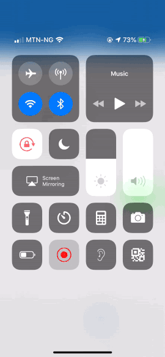

# BottomDrawer

[](https://travis-ci.org/sagaya/BottomDrawer)
[](https://cocoapods.org/pods/BottomDrawer)
[](https://cocoapods.org/pods/BottomDrawer)
[](https://cocoapods.org/pods/BottomDrawer)


BottomDrawer is an iOS component which presents a dismissible view from the bottom of the screen. BottomDrawer can be a useful replacement for popups and menus but can hold any viewcontroller so the use cases are endless. This repository includes the BottomDrawer component itself but also includes an extension for autolayout (NSLayoutConstraint)



## Installation

BottomDrawer is available through [CocoaPods](https://cocoapods.org). To install
it, simply add the following line to your Podfile:

```ruby
pod 'BottomDrawer'
```

## Getting Started

```swift
let request = self.storyboard?.instantiateViewController(withIdentifier: "test") as? TestViewController
//TestViewController has to subclass BottomController
let controller = BottomController()
controller.destinationController = request
controller.sourceController = self 
controller.startingHeight = 500
controller.movable = false //The view won't be movable 
controller.modalPresentationStyle = .overCurrentContext
self.present(v, animated: true, completion: nil)
```
## Example

To run the example project, clone the repo, and run `pod install` from the Example directory first.

## Requirements


## Author

sagaya, shaggy.hafeez@gmail.com

## License

BottomDrawer is available under the MIT license. See the LICENSE file for more info.
